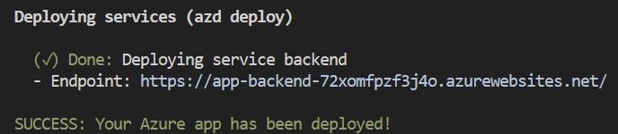

# Azure Conversational Assistant

## Features

- Chat (multi-turn) and Q&A (single turn) interfaces
- Renders citations and thought process for each answer
- Includes settings directly in the UI to tweak the behavior and experiment with options
- Integrates Azure AI Search for indexing and retrieval of documents, with support for [many document formats](/docs/data_ingestion.md#supported-document-formats) as well as [integrated vectorization](/docs/data_ingestion.md#overview-of-integrated-vectorization)
- Optional usage of [GPT-4 with vision](/docs/gpt4vision.md) to reason over image-heavy documents
- Optional addition of [speech input/output](/docs/deploy_features.md#enabling-speech-inputoutput) for accessibility
- Optional automation of [user login and data access](/docs/login_and_acl.md) via Microsoft Entra
- Performance tracing and monitoring with Application Insights

### Architecture Diagram


## Getting Started

### Local environment

1. Install the required tools:

   - [Azure Developer CLI](https://aka.ms/azure-dev/install)
   - [Python 3.9, 3.10, or 3.11](https://www.python.org/downloads/)
     - **Important**: Python and the pip package manager must be in the path in Windows for the setup scripts to work.
     - **Important**: Ensure you can run `python --version` from console. On Ubuntu, you might need to run `sudo apt install python-is-python3` to link `python` to `python3`.
   - [Node.js 18+](https://nodejs.org/download/)
   - [Git](https://git-scm.com/downloads)
   - [Powershell 7+ (pwsh)](https://github.com/powershell/powershell) - For Windows users only.
     - **Important**: Ensure you can run `pwsh.exe` from a PowerShell terminal. If this fails, you likely need to upgrade PowerShell.

2. Create a new folder and switch to it in the terminal.

3. Git clone this repository.

4. Run the `azure_rag` pipeline in Kedro to get the articles (approx 84 minutes).

5. Create a `data` folder in the `app` folder in this repository.

6. Copy the Azure RAG articles from `healthhub-content-optimization` repository under `content-optimization` > `data` > `03_primary` > `processed_articles` and paste it in `data` folder in this repository.

7. Copy the additional Azure RAG javascript articles from Google Drive `LLM Exploration` > `HealthHub` > `Data` > `Processed data for RAG` > `JSON files to be loaded for RAG` > `js_articles.zip` and paste it in `data` folder in this repository.

## Deploying

Follow these steps to provision Azure resources and deploy the application code:

1. Login to your Azure account:

   ```shell
   azd auth login
   ```

2. Create a new azd environment:

   ```shell
   azd env new
   ```

3. (Optional) This is the point where you can customize the deployment by setting environment variables, in order to [use existing resources](docs/deploy_existing.md), [enable optional features (such as auth or vision)](docs/deploy_features.md), or [deploy to free tiers](docs/deploy_lowcost.md).

4. Run `azd up` - This will provision Azure resources and deploy this sample to those resources, including building the search index based on the files found in the `./data` folder.

   - **Important**: Beware that the resources created by this command will incur immediate costs, primarily from the AI Search resource. These resources may accrue costs even if you interrupt the command before it is fully executed. You can run `azd down` or delete the resources manually to avoid unnecessary spending.
   - You will be prompted to select two locations, one for the majority of resources and one for the OpenAI resource, which is currently a short list. That location list is based on the [OpenAI model availability table](https://learn.microsoft.com/azure/cognitive-services/openai/concepts/models#model-summary-table-and-region-availability) and may become outdated as availability changes.

5. After the application has been successfully deployed you will see a URL printed to the console. Click that URL to interact with the application in your browser.
   It will look like the following:

   

> [!NOTE]
> It may take 5-10 minutes after you see 'SUCCESS' for the application to be fully deployed. If you see a "Python Developer" welcome screen or an error page, then wait a bit and refresh the page. See [guide on debugging App Service deployments](docs/appservice.md).

### Deploying again

If you've only changed the backend/frontend code in the `app` folder, then you don't need to re-provision the Azure resources. You can just run:

`azd deploy`

If you've changed the infrastructure files (`infra` folder or `azure.yaml`), then you'll need to re-provision the Azure resources. You can do that by running:

`azd up`

#### Sharing environments

To give someone else access to a completely deployed and existing environment,
either you or they can follow these steps:

1. Install the [Azure CLI](https://learn.microsoft.com/cli/azure/install-azure-cli)

2. Clone this repository.

3. Run `azd env refresh -e {environment name}`
   They will need the azd environment name, subscription ID, and location to run this command. You can find those values in your `.azure/{env name}/.env` file. This will populate their azd environment's `.env` file with all the settings needed to run the app locally.

4. Set the environment variable `AZURE_PRINCIPAL_ID` either in that `.env` file or in the active shell to their Azure ID, which they can get with `az ad signed-in-user show`.

5. Run `./scripts/roles.ps1` or `.scripts/roles.sh` to assign all of the necessary roles to the user. If they do not have the necessary permission to create roles in the subscription, then you may need to run this script for them. Once the script runs, they should be able to run the app locally.

## Running locally

You can only run locally **after** having successfully run the `azd up` command. If the deployment has been done previously, do **not** run `azd up`. Otherwise, follow the [deploying](#deploying) steps above.

1. Run `azd auth login`
2. Change dir to `app`
3. Run `./start.ps1` or `./start.sh` or run the "VS Code Task: Start App" to start the project locally.

See more tips in [the local development guide](docs/localdev.md).

## Running webapp locally to test on other devices

To test the webapp locally on other devices in the same network, follow the steps below:

1. Navigate to the `app` folder
2. Run this command `make ssl-cert` or `openssl req -x509 -newkey rsa:4096 -keyout key.pem -out cert.pem -days 365 -nodes`
3. Fill up the information however you like
4. Run `./startwithssl.sh` or `./startwithssl.ps1`
5. Access the webapp via `https://{ipv4 address of the machine running the webapp}:50505`

> [!NOTE]
>
> To find ipv4 address of the machine, run `ipconfig` on Windows or `ifconfig` on Linux/MacOS

## Using the app

- In Azure: navigate to the Azure WebApp deployed by azd. The URL is printed out when azd completes (as "Endpoint"), or you can find it in the Azure portal.
- Running locally: navigate to 127.0.0.1:50505

Once in the web app:

- Try different topics in chat or Q&A context. For chat, try follow up questions, clarifications, ask to simplify or elaborate on answer, etc.
- Explore citations and sources
- Click on "settings" to try different options, tweak prompts, etc.

## Install the Git Hook Scripts

Run pre-commit install to set up the git hook scripts:

```zsh
pre-commit install

> pre-commit installed at .git/hooks/pre-commit
```

This command sets up the git hooks and run them automatically before every commit. For more information, refer to the [pre-commit docs](https://pre-commit.com/). To see what hooks are used, refer to the [`.pre-commit-config.yaml`](.pre-commit-config.yaml) YAML file.

### (Optional) Run `pre-commit run --all-files`

Optionally, you can also run the command `pre-commit run --all-files` to lint and reformat your code. It's usually a good idea to run the hooks against all of the files when adding new hooks (usually pre-commit will only run on the changed files during git hooks).

Alternatively, there is a [`Makefile`](Makefile) that can also lint and reformat your code base when you run the simpler command `make lint`.

You should ensure that all cases are satisfied before you push to GitHub (you should see that all has passed). If not, please debug accordingly or your pull request may be rejected and closed.

The [`run-checks.yml`](.github/workflows/run-checks.yml) is a GitHub workflow that kicks off several GitHub Actions when a pull request is made. These GitHub Actions check that your code have been properly linted and formatted before it is passed for review. Once all actions have passed and the PR approved, your changes will be merged to the `main` branch.

> [!NOTE]
> The `pre-commit` will run regardless if you forget to explicitly call it. Nonetheless, it is recommended to call it explicitly so you can make any necessary changes in advanced.

## Workflow
>
> [!NOTE]
> Before making any commits/PR, ensure that you have setup [pre-commit](#install-the-git-hook-scripts) and passed all the checks.

### Data

- Any code changes for **Data** can be PR'd to `main` without going through `staging` branch.

### Frontend, Backend and Prompt

1. Any code changes for **Frontend, Backend and Prompt** must be PR'd to the `staging` branch instead of `main`.
2. Ensure `staging` branch is stable before PR'ing to `main`. (@lyndonlim27)

### Dependabot dependency updates

1. Test the dependency updates requested by dependabot locally.
2. If the updates are successful, PR the changes to the `staging` branch.
3. Close the PR made by Dependabot and tag it with your new PR.

> [!NOTE]
>
> 1. If updates are not possible due to dependency conflicts, add the dependency name to [`dependabot.yml`](.github/dependabot.yml) under `ignore` section.
> 2. Create a PR to `staging` branch
> 3. Close the PR made by Dependabot and tag it with your new PR.

## Notebooks

1. `azure_data_actual.ipynb` is the notebook to generate the data from the parquet file for ingestion into the index.
2. `azure_data_testing.ipynb` is the notebook to generate the data from a subset of the parquet file for small ingestion into the index for testing.
3. `azure_search_tutorial_v3.0.ipynb` is the notebook to ingest the data into the index.

> [!NOTE]
>
> To find ipv4 address of the machine, run `ipconfig` on Windows or `ifconfig` on Linux/MacOS
