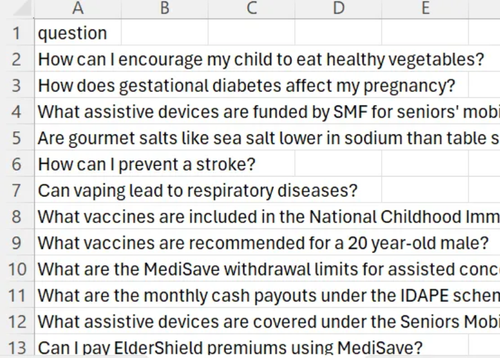

# RAG Evaluation (Deepeval)

Deepeval is used to perform the evaluation for RAG (Retrieval-Augmented Generation).

Under this `eval` folder, there are two scripts named `ans_generation.py` and `eval.py`.

Before running any of the two scripts, run the following commands:

1. Activate the virtual environment:

    ```shell
   .venv\Scripts\activate
   ```

2. Change to the correct project directory:

    ```shell
   cd eval
   ```

3. Install dependencies specified in `requirements.txt` under `eval` folder:

    ```shell
   pip install -r requirements.txt
   ```

4. Login to your Azure account:

    ```shell
   azd auth login
   ```

## Answer Generation

The `ans_generation.py` generates answers for a given CSV file input with a list of questions.

The steps to run `ans_generation.py` are:

1. In the `eval` folder, create an `input` and `output` subfolder.

2. Upload your CSV file with a list of questions under the `input` subfolder.
    - Ensure that the column header is `question`:
    

3. Run the following command:

    ```shell
   python ans_generation.py --readfilepath input/sample_question_bank_5.csv --usevectorsearch --usetextsearch --usesemanticranker
   ```

   - Change the `readfilepath` accordingly.

A successful `ans_generation.py` script run will save the Generated answers and source information into a CSV file under the `output` folder, named `generated_answers_for_eval.csv`.

## Evaluation (Deepeval)

Using the output `generated_answers_for_eval.csv` from `ans_generation.py`, `eval.py` evaluates the generated question using the Deepeval framework. The metrics used from Deepeval are Answer Relevancy, Faithfulness and Contextual Relevancy

The steps to run `ans_generation.py` are:

1. Run the following command:

    ```shell
   python eval.py --readfilepath output/generated_answers_for_eval.csv --model gpt-4o-mini --asyncmode
   ```

    - Change the `readfilepath` accordingly.
    - Change the model argument accordingly (`gpt-4o-mini`/`gpt-4o`).
        > [!NOTE]
        > If using gpt-4o-mini for evaluation, create a `.env` file in the `eval` folder with these credentials:

        ```.env
        # Azure OpenAI Services
        AZURE_OPENAI_API_TYPE="xx"
        AZURE_OPENAI_API_VERSION="xx"
        AZURE_OPENAI_CHATGPT_DEPLOYMENT="xx"
        AZURE_OPENAI_SERVICE="xx"
        ```

    - Include `--asyncmode` to run in async mode. Otherwise, do not include `--asyncmode` to use sync mode .

A successful `eval.py` script run will save the evaluation results in a file named `deepeval_results_<model_name>_<date>_<time>.csv`, under the `output` folder.

### async mode vs sync mode

The pros and cons of running in async mode vs in sync mode are detailed in the table below:

|                | async mode                                 | sync mode                                               |
|----------------|---------------------------------------------|---------------------------------------------------------|
| **Pros**       | Faster                                      | Able to generate full results even if there are test cases with error |
| **Cons**       | If there is error for any one of the test case (e.g., content filter, rate limit), interim results will not be saved. | Slower                                                  |

Even though async mode runs ten times faster than sync mode, sync mode is preferred in order to conveniently debug any errors encountered during evaluation.
